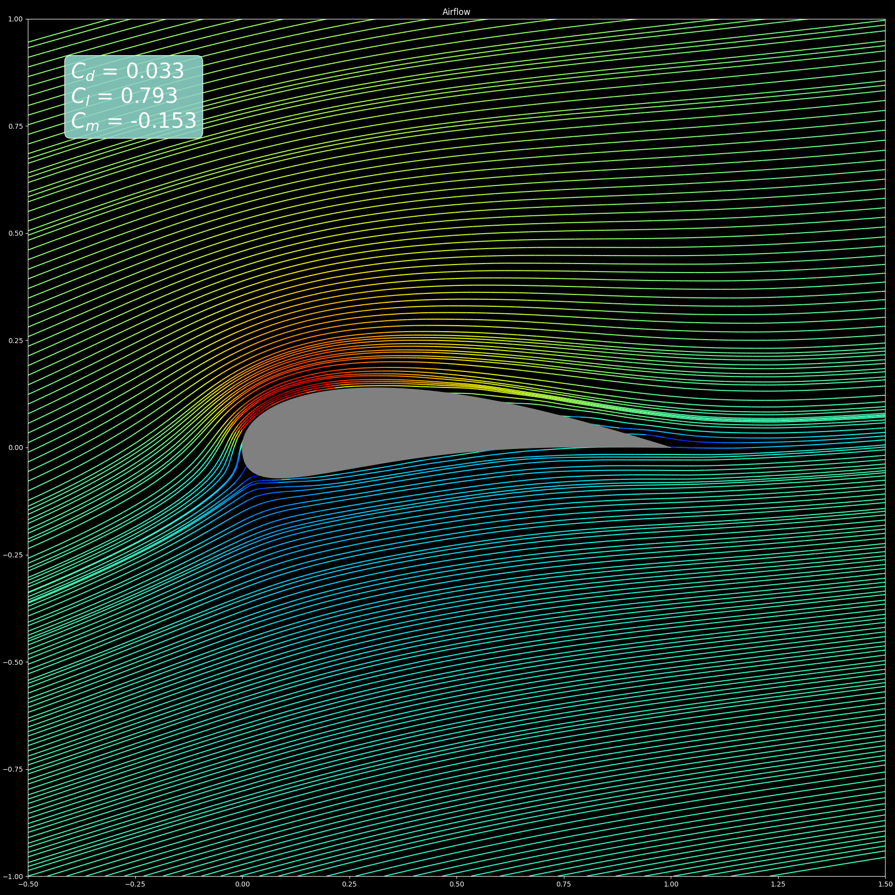

# Airfoil CFD with neural networks 
Simulate the behaviour of airflow around airfoils using neural networks.<br>
Trained on the [Airfoil Computational Fluid Dynamics - 9k shapes, 2 AoA's ](https://catalog.data.gov/dataset/airfoil-computational-fluid-dynamics-9k-shapes-2-aoas) dataset.
## How to run

- Install requirements ``` pip install -r requirements.txt ```
- Run ``` python inference.py ``` to test the model
- [Optional] Run ``` python data_preprocessing.py``` to download the data and perform the preprocessing.<br>
The download is about 52.7 GB
- [Optional] Run ``` python train.py ``` to train a new model

# Data files
The ``` data ``` folder contains the following files:
- ``` coefs_scaler.pkl``` : saved instance of ``` MinMaxScaler ``` used for the Cl, Cd and Cm normalization
- ``` features_scaler.pkl ```: saved instance of ``` MinMaxScaler ``` used for velocity, density and energy normalization
- ``` grid_scaler.pkl ``` : saved instance of ``` MinMaxScaler ``` used for grid normalization
- ``` grid_coords.npy ```: arrays containing the normalized x and y points coordinates
- ``` test_airfoils.h5 ```: normalized test/evaluation set
- ``` train_sirfoils.h5 ```: normalized training set

## Inference example

### Airfoil editor


### Airflow streamlines


### Airflow quantities

